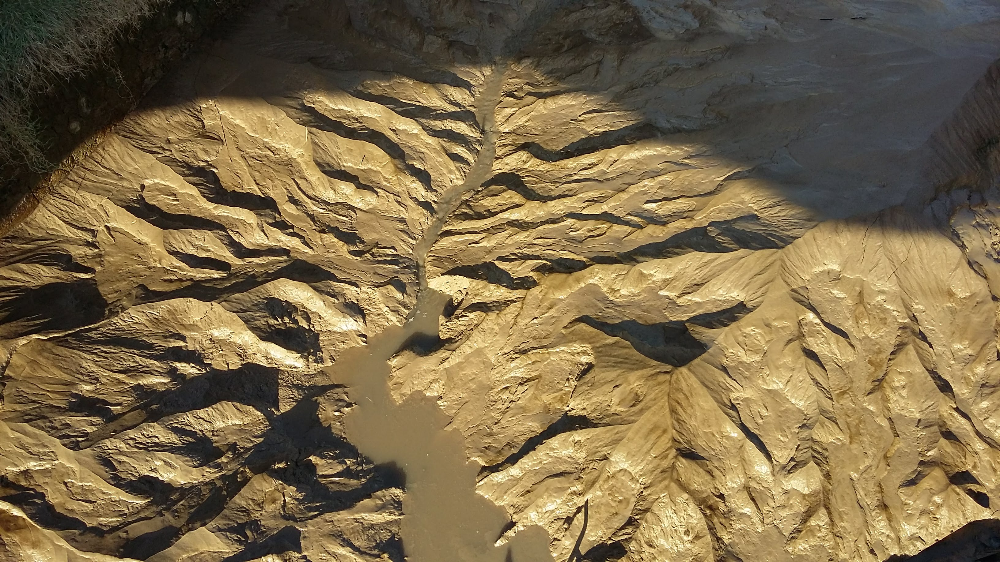



## Overview

[LSDTopoTools](https://lsdtopotools.github.io/) is a collection of software tools for [analysing](https://lsdtopotools.github.io/LSDTT_documentation/LSDTT_basic_usage.html) [topography](https://lsdtopotools.github.io/LSDTT_documentation/LSDTT_chi_analysis.html). It also contains tools for [cosmogenic nuclide analyses](https://lsdtopotools.github.io/LSDTT_documentation/LSDTT_BasinwideCRN.html), [landscape evolution](https://lsdtopotools.github.io/LSDTT_documentation/LSDTT_MuddPILE.html), and [hydrology](https://lsdtopotools.github.io/LSDTT_documentation/LSDTT_floodplains_terraces.html). 

### Some things LSDTopoTools can do

* [Basic topographic analysis](https://lsdtopotools.github.io/LSDTT_documentation/LSDTT_basic_usage.html), e.g., slopes, channel networks, basic raster calculations etc. 
* [Algorithmic extraction of drainage networks](https://lsdtopotools.github.io/LSDTT_documentation/LSDTT_channel_extraction.html), using a wide range of algorithms. See [Clubb et al., 2014](https://agupubs.onlinelibrary.wiley.com/doi/full/10.1002/2013WR015167) and [Grieve et al., 2016a](https://www.earth-surf-dynam.net/4/627/2016/esurf-4-627-2016.html).
* Algorithmic extraction of rock outcrops, see [Milodowski et al., 2015](https://www.earth-surf-dynam.net/3/483/2015/)
* Analysis of channel steepness for tectonic geomorphology applications. See [Mudd et al., 2014](https://agupubs.onlinelibrary.wiley.com/doi/full/10.1002/2013JF002981). In addition tools for determining channel concavity. See [Mudd et al., 2018](https://www.earth-surf-dynam.net/6/505/2018/)
* Extraction and statistical analysis of knickpoints. See [Gailleton et al., 2018](https://www.earth-surf-dynam.net/7/211/2019/).
* Extraction of drainage density [see Clubb et al., 2016](https://agupubs.onlinelibrary.wiley.com/doi/full/10.1002/2015JF003747), floodplains, and terraces [see Clubb et al., 2017](https://www.earth-surf-dynam.net/5/369/2017/).
* Tools for understanding the geometry of drainage basins. See [Grieve et al., 2018](https://agupubs.onlinelibrary.wiley.com/doi/full/10.1029/2017JF004453)
* A wide range of tools for exploring hillslope geometry and how it relates to transient incision. See [Hurst et al., 2012](https://agupubs.onlinelibrary.wiley.com/doi/full/10.1029/2011JF002057); [Hurst et al., 2013](https://science.sciencemag.org/content/341/6148/868.full); [Grieve et al, 2016b](https://onlinelibrary.wiley.com/doi/full/10.1002/esp.3884); [Grieve et al, 2016c](https://www.earth-surf-dynam.net/4/309/2016/); [Hurst et al., 2019](https://www.sciencedirect.com/science/article/pii/S0012821X19303577).
* Tools for understanding the relationship between lithology and channel steepness. See [Mudd et al., 2018](https://www.earth-surf-dynam.net/6/505/2018/); [Bernard et al., 2019](https://www.sciencedirect.com/science/article/pii/S0012821X19302389); [Strong et al., 2019](https://www.sciencedirect.com/science/article/pii/S0169555X19300248).
* Tools for calculating basinwide erosion rates from nuclides such as 10Be and 26Al. See [Mudd et al., 2016](https://www.earth-surf-dynam.net/4/655/2016/esurf-4-655-2016.html); [Codilean et al., 2018](https://www.earth-syst-sci-data.net/10/2123/2018/)
* A simple landscape evolution model. See [Mudd et al., 2017](https://onlinelibrary.wiley.com/doi/full/10.1002/esp.3923)

## Documentation

We have several hundred pages of [documentation](https://lsdtopotools.github.io/LSDTT_documentation/index.html) about LSDTopoTools. It can be found on our [documentation website](https://lsdtopotools.github.io/LSDTT_documentation/index.html). 

If you actually want to get inside the source code, our [API also has documentation](https://lsdtopotools.github.io/LSDTT_public/index.html).

## Citing LSDTopoTools

The most general citations for LSDTopoTools are:

* [LSDTopoTools2: the main software](https://zenodo.org/record/3245041#.Xcv3h1f7SUk): Mudd, S. M., Clubb, F. J., Grieve, S. W. D., Milodowski, D. T., Hurst, M. D., Gailleton, B., & Valters, D. A. (2019, June 13). LSDTopoTools2 (Version v0.02). Zenodo. http://doi.org/10.5281/zenodo.3245041
* [LSDTopoTools documentation](https://zenodo.org/record/3245076#.Xcv30Ff7SUk): Simon Marius Mudd, Boris Gailleton, Fiona Clubb, Stuart Grieve, & Declan Valters. (2019, June 13). LSDtopotools/LSDTT_documentation: LSDTopoTools2 v2.01 (Version v2.01). Zenodo. http://doi.org/10.5281/zenodo.3245076
* [LSDMappingTools: Our python visualisation packages](https://zenodo.org/record/3245076#.Xcv39Vf7SUk): Simon Marius Mudd, Boris Gailleton, Fiona Clubb, Stuart Grieve, & Declan Valters. (2019, June 13). LSDtopotools/LSDTT_documentation: LSDTopoTools2 v2.01 (Version v2.01). Zenodo. http://doi.org/10.5281/zenodo.3245076

We also maintain a [zenodo collection](https://zenodo.org/search?page=1&size=20&q=lsdtopotools) for all the released software. 

If you are using specific algorithms developed by our group and published in the scientific literature, please cite the relevant paper. 

